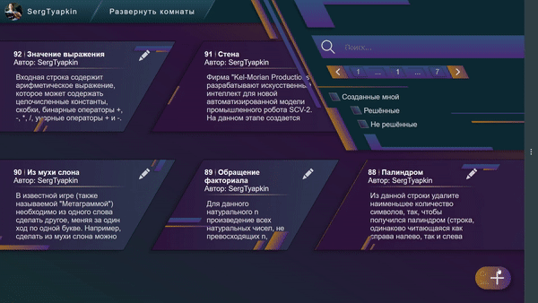
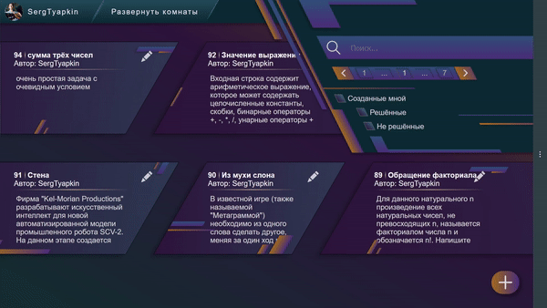

# Запись действий мыши и клавиатуры
Записывает не все действия, а действия задаются по нажатию на копки. Скажем "нет" срачу в конфигах

> Поддерживаются разные функции скорости движения курсора мыши. На данный момент есть linear, ease-out, ease-out-light

Примеры полностью автоматической работы:


---
# Запуск
### 0. Первым делом необходимо установить недостающие библиотеки mouse и keyboard
```shell
python -m pip install keyboard
python -m pip install mouse
```

### 1. Запустить настройщик кнопок управления
Здесь можно выбрать, на какие действия во время записи повесить какие горячие клавиши.

После этого конфиг запишется в `UserControls.json`
```shell
python main_controls_configure.py
```

### 2. Запустить запись
Во время записи по кнопкам, настроенным на 1 шаге, можно добавлять в запись события, такие как:
- перенос положения мыши
- переход к последнему сохранённому положению мыши
- смена выбранной кнопки мыши
- клик/нажатие/отпускание выбранной кнопку мыши


- клик/нажатие/отпускание кнопки клавиатуры
- набор длинного текста

`Escape` - Окончание записи.
После этого json-файл с записью будет сохранён в папку `recordings`
под названием `recording_<дата-и-время-окончания-записи>.json`
```shell
python main_make_recording.py
```

### 3. Запустить воспроизведение записи
При запуске программа попросит ввести имя файла из папки `recordings`.
Если не ввести ничего, будет выбран последний файл по дате создания.

Затем воспроизводятся все действия из выбранного файла по очереди.
```shell
python main_play_recording.py
```

Также можно передать имя файла в качестве аргумента
```shell
python main_play_recording.py my_recording.json
```

---
# О структуре файлов
Файл любой записи можно редактировать как обычный текст.
Так можно удобно настроить время задержек и выполнения действий.

Файл состоит из списка действий-объектов.
Все возможные свойства с описанием:
```json5
[
    // For mouse events:
    {
        "class": "mouse",
        "type": "move", // move / click / hold / release / scroll
        "after": 1.5, // seconds
      
        // only for "move":
        "x": -997, 
        "y": -301,
        "timing-function": "ease-out", // linear / ease-out / ease-out-light. Default: ease-out
        "duration": 2.5, // seconds
        
        // for "click / hold / release"
        "button": "left", // left / middle / right
      
        // for "scroll"
        "duration": 1.2, // seconds
        "delta": -2.0, // scroll value
    },
  
    // For keyboard events:
    {
        "class": "keyboard",
        "type": "hit", // hit / hold / release / text
        "after": 1.5, // seconds
      
        // for "hit / hold / release":
        "hotkey": "ctrl+shift+t",
        
        // for "text"
        "duration": 12.5, // seconds
        "text": ["ctrl+h", "e", "l", "l", "o", "shift+1"] // list of hotkeys
    },
  
    // ...
]
```
